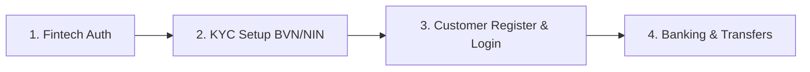

# NIBBS Banking Proxy — API & System Usage Guide

This project is an API proxy and customer management layer that sits between client applications (frontend / Postman) and the external **NIBSS API**. It manages local customer accounts in **MongoDB** while coordinating identity verification, account generation, and fund transfers through NIBSS.

---

## Prerequisites & Environment Setup

1. **MongoDB**: Ensure MongoDB is running locally (`mongodb://localhost:27017/nibbs_banking`).
2. **Environment Variables (`.env`)**:
   ```env
   PORT=3000
   MONGO_DB_URI=mongodb://localhost:27017/nibbs_banking
   JWT_SECRET=supersecret_nibbs_jwt_key_2026
   NIBSS_BASE_URL=https://nibssbyphoenix.onrender.com
   ```
3. **Start the Server**:
   ```bash
   npm run dev
   ```
   Base URL: `http://localhost:3000`

---

## Complete Workflow Architecture



1. **Fintech logs in**: Caches the external NIBSS token in server memory (`lib/nibbsTokenStore.js`).
2. **KYC records exist**: BVN or NIN is created and validated.
3. **Customer registers**: Backend validates with NIBSS, generates a 10-digit NIBAN account, and stores the user in MongoDB.
4. **Customer logs in**: Gets a JWT token to perform protected operations (transfers, transaction history).

---

## 1. Fintech Authentication (Run First)

> [!IMPORTANT]
> The backend communicates with NIBSS using a server-side cached token. You **must** run `POST /api/auth/token` before making calls to NIBSS-dependent endpoints.

### 1.1 Onboard Fintech
- **Endpoint**: `POST /api/fintech/onboard`
- **Headers**: `Content-Type: application/json`
- **Request Body**:
```json
{
  "name": "Nova Pay",
  "email": "admin@novapay.com"
}
```
- **Demo Response (201 Created)**:
```json
{
  "success": true,
  "message": "Fintech onboarded successfully on NIBSS",
  "data": {
    "apiKey": "44ec2f6b5bbacdd19b6af5e96490a135",
    "apiSecret": "5ef28631ed97bebf0da40cf33b50390d6f77b3155635b8f4e2fa76b7d6a3e030",
    "bankCode": "278",
    "bankName": "NOV Bank Express"
  }
}
```

### 1.2 Fintech Login
- **Endpoint**: `POST /api/auth/token`
- **Headers**: `Content-Type: application/json`
- **Request Body**:
```json
{
  "apiKey": "44ec2f6b5bbacdd19b6af5e96490a135",
  "apiSecret": "5ef28631ed97bebf0da40cf33b50390d6f77b3155635b8f4e2fa76b7d6a3e030"
}
```
- **Demo Response (200 OK)**:
```json
{
  "success": true,
  "message": "Authentication successful",
  "token": "eyJhbGciOiJIUzI1NiIsIn...",
  "fintech": {
    "name": "Nova Pay",
    "email": "admin@novapay.com",
    "bankCode": "278"
  }
}
```
*(The token is automatically stored in server memory for all downstream NIBSS calls).*

---

## 2. KYC Services (BVN & NIN)

### 2.1 Create BVN
- **Endpoint**: `POST /api/bvn/insertBvn`
- **Headers**: `Content-Type: application/json`
- **Request Body**:
```json
{
  "bvn": "22345678901",
  "firstName": "Joseph",
  "lastName": "Cruz",
  "dob": "1995-05-15",
  "phone": "08012345678"
}
```
- **Demo Response (201 Created)**:
```json
{
  "success": true,
  "message": "Account created successfully",
  "data": {
    "success": true,
    "message": "BVN record created successfully.",
    "data": {
      "bvn": "22345678901",
      "firstName": "Joseph",
      "lastName": "Cruz",
      "dob": "1995-05-15T00:00:00.000Z",
      "phone": "08012345678"
    }
  }
}
```

### 2.2 Validate BVN
- **Endpoint**: `POST /api/bvn/validateBvn`
- **Headers**: `Content-Type: application/json`
- **Request Body**:
```json
{
  "bvn": "22345678901"
}
```
- **Demo Response (200 OK)**:
```json
{
  "success": true,
  "message": "BVN validated successfully",
  "data": {
    "success": true,
    "message": "BVN validation successful.",
    "data": {
      "bvn": "22345678901",
      "firstName": "Joseph",
      "lastName": "Cruz",
      "dob": "1995-05-15T00:00:00.000Z"
    }
  }
}
```

### 2.3 Create NIN
- **Endpoint**: `POST /api/nin/insertNin`
- **Headers**: `Content-Type: application/json`
- **Request Body**:
```json
{
  "nin": "12345678901",
  "firstName": "Joseph",
  "lastName": "Cruz",
  "dob": "1995-05-15"
}
```
- **Demo Response (201 Created)**:
```json
{
  "success": true,
  "message": "NIN created successfully",
  "data": {
    "success": true,
    "message": "NIN record created successfully."
  }
}
```

### 2.4 Validate NIN
- **Endpoint**: `POST /api/nin/validateNin`
- **Headers**: `Content-Type: application/json`
- **Request Body**:
```json
{
  "nin": "12345678901"
}
```
- **Demo Response (200 OK)**:
```json
{
  "success": true,
  "message": "NIN validated successfully",
  "data": {
    "success": true,
    "message": "NIN validation successful."
  }
}
```

---

## 3. Customer Authentication & Registration

### 3.1 Register Customer (MongoDB + NIBSS)
Validates KYC with NIBSS first. If valid, provisions a 10-digit NIBAN account and creates the `Customer` and `Account` records in MongoDB.
- **Endpoint**: `POST /api/customers/register`
- **Headers**: `Content-Type: application/json`
- **Request Body**:
```json
{
  "firstName": "Joseph",
  "lastName": "Cruz",
  "email": "joseph.cruz@gmail.com",
  "password": "Password123!",
  "kycType": "bvn",
  "kycID": "22345678901",
  "dob": "1995-05-15"
}
```
- **Demo Response (201 Created)**:
```json
{
  "success": true,
  "message": "Customer registered successfully",
  "data": {
    "id": "6a9b3f795098528c7b1d1a35",
    "firstName": "Joseph",
    "lastName": "Cruz",
    "email": "joseph.cruz@gmail.com",
    "accountNumber": "2786685610",
    "onboardingStatus": "VERIFIED"
  }
}
```

### 3.2 Customer Login
- **Endpoint**: `POST /api/customers/login`
- **Headers**: `Content-Type: application/json`
- **Request Body**:
```json
{
  "email": "joseph.cruz@gmail.com",
  "password": "Password123!"
}
```
- **Demo Response (200 OK)**:
```json
{
  "success": true,
  "message": "Login successful",
  "token": "eyJhbGciOiJIUzI1NiIsIn...",
  "customer": {
    "id": "6a9b3f795098528c7b1d1a35",
    "firstName": "Joseph",
    "lastName": "Cruz",
    "email": "joseph.cruz@gmail.com",
    "accountNumber": "2786685610"
  }
}
```
> [!TIP]
> Copy the returned `token`. This is the Customer JWT required for fund transfers and transaction history.

---

## 4. Banking Services

### 4.1 Create Account Directly (Proxy)
- **Endpoint**: `POST /api/account/create`
- **Headers**: `Content-Type: application/json`
- **Request Body**:
```json
{
  "kycType": "bvn",
  "kycID": "22345678901",
  "dob": "1995-05-15"
}
```
- **Demo Response (201 Created)**:
```json
{
  "success": true,
  "message": "Account created successfully",
  "data": {
    "message": "Account created successfully",
    "account": {
      "accountNumber": "2786685610",
      "accountName": "Joseph Cruz",
      "balance": 15000
    }
  }
}
```

### 4.2 Get All Accounts
- **Endpoint**: `GET /api/accounts/all`
- **Headers**: *(None)*
- **Demo Response (200 OK)**:
```json
{
  "success": true,
  "message": "Account details retrieved successfully",
  "accounts": {
    "accountNumber": "2786685610",
    "accountName": "Joseph Cruz",
    "balance": 15000
  }
}
```

### 4.3 Name Enquiry
- **Endpoint**: `GET /api/name-enquiry/name-enquiry`
- **Headers**: `Content-Type: application/json`
- **Request Body**:
```json
{
  "accountNumber": "2786685610"
}
```
- **Demo Response (200 OK)**:
```json
{
  "success": true,
  "message": "Account details retrieved successfully",
  "data": {
    "accountNumber": "2786685610",
    "accountName": "Joseph Cruz",
    "bankCode": "278",
    "bankName": "NOV Bank Express"
  }
}
```

### 4.4 Check Account Balance
- **Endpoint**: `GET /api/balance/balance/:accountNumber`
- **Example URL**: `http://localhost:3000/api/balance/balance/2786685610`
- **Headers**: *(None)*
- **Demo Response (200 OK)**:
```json
{
  "success": true,
  "message": "Account balance retrieved successfully",
  "account": {
    "accountNumber": "2786685610",
    "accountName": "Joseph Cruz",
    "balance": 15000
  }
}
```

---

## 5. Transfers & Transaction Records

### 5.1 Initiate Transfer (Protected)
- **Endpoint**: `POST /api/transfer/transfer`
- **Headers**:
  - `Content-Type: application/json`
  - `Authorization: Bearer <CUSTOMER_JWT_FROM_LOGIN>`
- **Request Body**:
```json
{
  "from": "2786685610",
  "to": "1084071287",
  "amount": 2000
}
```
- **Workflow Executed**:
  1. Validates caller owns the `from` account.
  2. Runs recipient Name Enquiry.
  3. Checks sufficient sender balance.
  4. Calls NIBSS `/api/transfer`.
  5. Queries TSQ to confirm status.
  6. Stores `DEBIT` transaction document in MongoDB.
- **Demo Response (200 OK)**:
```json
{
  "success": true,
  "message": "Transfer successful",
  "data": {
    "success": true,
    "message": "Transfer successful",
    "transactionId": "TXN_1788559224342_891"
  }
}
```

### 5.2 Transaction Status Query (TSQ)
- **Endpoint**: `GET /api/transaction/query`
- **Headers**: `Content-Type: application/json`
- **Request Body**:
```json
{
  "transactionId": "TXN_1788559224342_891"
}
```
- **Demo Response (200 OK)**:
```json
{
  "success": true,
  "message": "Transfer status successfully retrieved",
  "data": {
    "transactionId": "TXN_1788559224342_891",
    "status": "SUCCESS",
    "amount": 2000,
    "from": "2786685610",
    "to": "1084071287"
  }
}
```

### 5.3 View Customer Transaction History (Protected)
- **Endpoint**: `GET /api/customers/transactions`
- **Headers**:
  - `Authorization: Bearer <CUSTOMER_JWT_FROM_LOGIN>`
- **Demo Response (200 OK)**:
```json
{
  "success": true,
  "message": "Transaction history retrieved successfully",
  "transactions": [
    {
      "_id": "6a9b40095098528c7b1d1a40",
      "account": "6a9b3f795098528c7b1d1a36",
      "externalTransactionId": "TXN_1788559224342_891",
      "type": "TRANSFER",
      "direction": "DEBIT",
      "amount": 2000,
      "status": "SUCCESS",
      "recipientAccountNumber": "1084071287",
      "recipientAccountName": "Jane Doe",
      "recipientBank": "ZEN Bank",
      "createdAt": "2026-09-05T18:10:00.000Z"
    }
  ]
}
```

---

## Postman Quick Reference Table

| # | Action | Method | Endpoint | Auth Header |
|---|---|:---:|---|:---:|
| 1 | Onboard Fintech | `POST` | `/api/fintech/onboard` | No |
| 2 | Login Fintech | `POST` | `/api/auth/token` | No |
| 3 | Create BVN | `POST` | `/api/bvn/insertBvn` | No |
| 4 | Validate BVN | `POST` | `/api/bvn/validateBvn` | Server |
| 5 | Create NIN | `POST` | `/api/nin/insertNin` | No |
| 6 | Validate NIN | `POST` | `/api/nin/validateNin` | Server |
| 7 | Register Customer | `POST` | `/api/customers/register` | Server |
| 8 | Login Customer | `POST` | `/api/customers/login` | No |
| 9 | Direct Account Create | `POST` | `/api/account/create` | Server |
| 10 | List All Accounts | `GET` | `/api/accounts/all` | Server |
| 11 | Name Enquiry | `GET` | `/api/name-enquiry/name-enquiry` | Server |
| 12 | Check Balance | `GET` | `/api/balance/balance/:accountNumber` | Server |
| 13 | Fund Transfer | `POST` | `/api/transfer/transfer` | `Bearer <Customer_JWT>` |
| 14 | Query Transaction (TSQ) | `GET` | `/api/transaction/query` | Server |
| 15 | Customer Transactions | `GET` | `/api/customers/transactions` | `Bearer <Customer_JWT>` |
